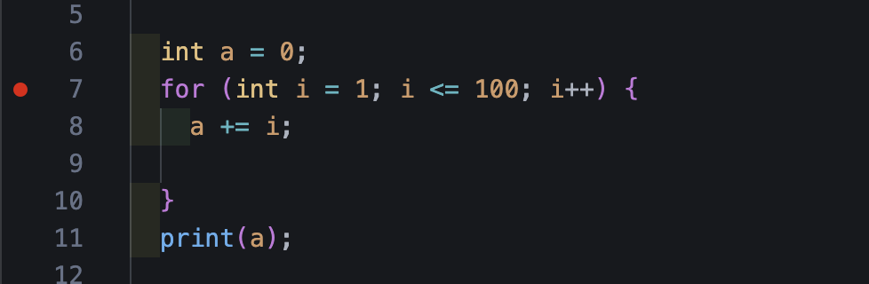

# 플러터 아침 스터디 기록

- 시작일자 : 2025년 12월 03일

## 목표
- [x] git 맛보기
- [ ] git 마스터
- [ ] 다트 마스터 
- [ ] 플러터 마스터

## Repository에 올리는 법
### 최초일때
1. 깃 허브 레포지토리 만들기
2. 폴더 만들기 (바탕화면 or proj)
3. VSCode에서 폴더 열고 올릴파일 만들기 (README.md)
4. 저장소 초기화
    - 명령어 : `git init`
    - 초기화 시 만든폴더에 `.git` 폴더가 생김
5. 임시역역(스테이징 영역)에 파일 추가하기
    - 명령어 : `git add .`
    - `add` 뒤에 `.` 은 현재 폴더 내의 모든 파일을 의미함.
    - 현재 폴더는 터미널에서의 작업 영역
6. 브랜치에 기록하기 (최종 저장)
    - 명령어 : `git commit -m "커밋메시지"`
    - 커밋메시지는 변경된 내용을 메모하기 위한 용도
7. 원격 저장소 연결
    - 명령어 (깃허브 레포지토리 윗블럭 가장 아래줄 3줄)
    ```sh
    git branch -M main
    git remote add origin https://github.com/eunseong0207/flutter-study-9.git
    git push -u origin main
    ```


8. 깃 허브에 올리기 (7번에 포함되어 있어서 안해도 됨)
    - 명령어 : `git push origin main`

### 이후
1. 임시역역(스테이징 영역)에 파일 추가하기
    - 명령어 : `git add .`
    - `add` 뒤에 `.` 은 현재 폴더 내의 모든 파일을 의미함.
    - 현재 폴더는 터미널에서의 작업 영역
2. 브랜치에 기록하기 (최종 저장)
    - 명령어 : `git commit -m "커밋메시지"`
    - 커밋메시지는 변경된 내용을 메모하기 위한 용도
3. 깃 허브에 올리기 
    - 명령어 : `git push origin main` , `git Push`

## 꿀팁
- 맥에서 Option 버튼 + 벡틱 누르면 한글일때도 입력된다.
    - by 지은성 2025.12.03

- by 튜터님
- VSCord 내 터미널 오픈 : `커맨드 + J`
- 파일 수정 후에는 항상 저장해서 파일명 우측에 동그라미 없는지 확인
- VSCord 멀티라인 : Option + command + `화살표 위,아래`
- switch, for 문 만들때 자동완성 기능 활용해서 전체 블럭 만들수 있음
- ; 은 코드가 끝나는지점에 작성함
- 코드 라인수 옆 빨간점 (브레이크포인트) 만들고 `디버그모드`에서 해당줄부터 한줄씩 실행하면서 변수 확인 가능
- 